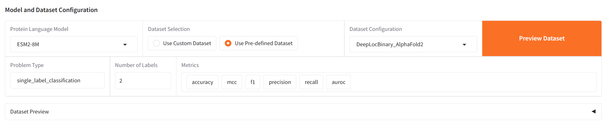
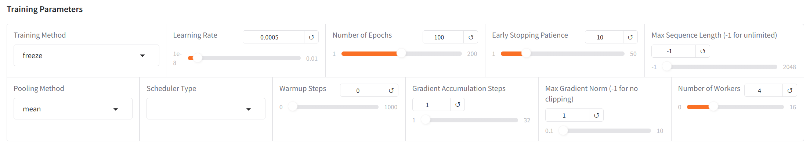
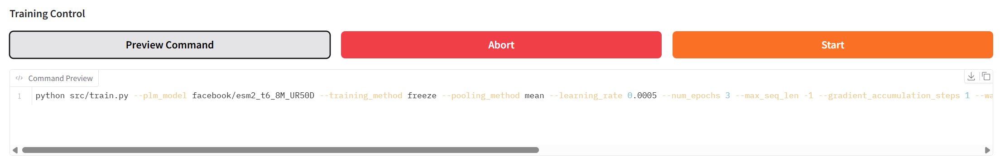
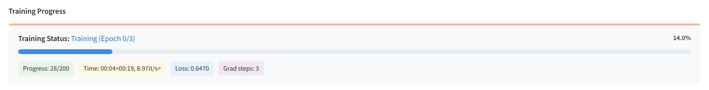
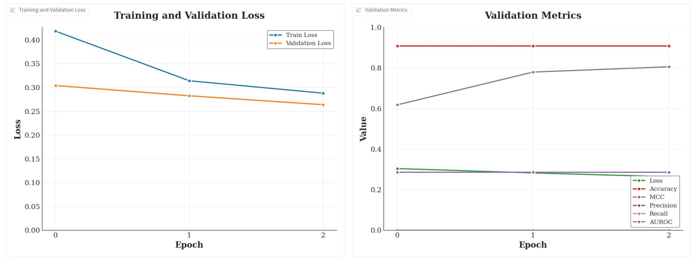
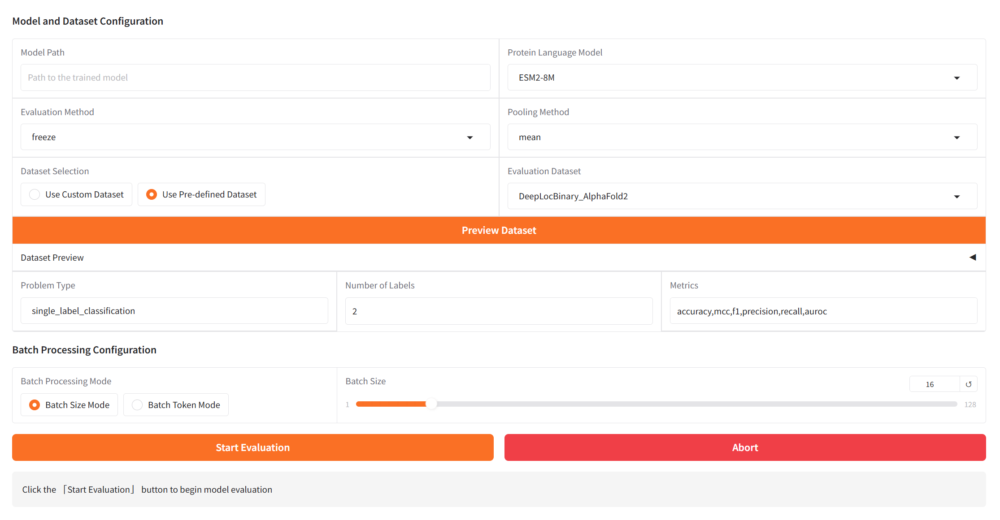
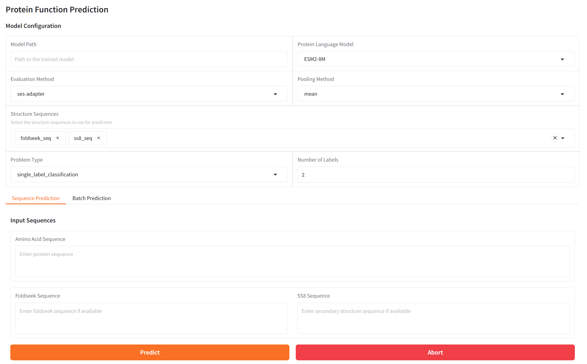
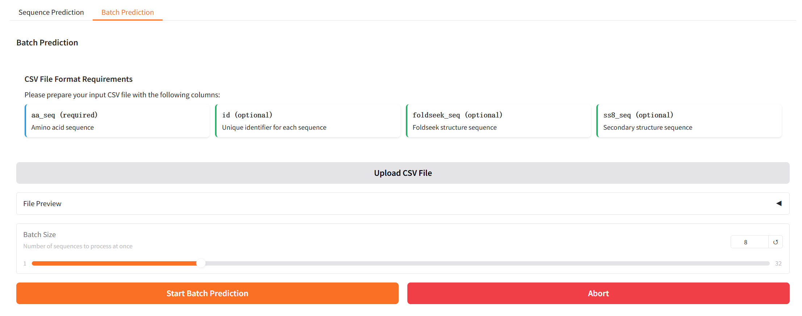

<div align="right">
  <a href="README.md">English</a> | <a href="README_CN.md">简体中文</a>
</div>

<p align="center">
  
</p>

<div align="center">

[](https://github.com/tyang816/VenusFactory/stargazers) [](https://github.com/tyang816/VenusFactory/network/members) [](https://github.com/tyang816/VenusFactory/issues) [](https://github.com/tyang816/VenusFactory/blob/main/LICENSE)
[](https://www.python.org/) [](https://venusfactory.readthedocs.io/) [](https://github.com/tyang816/VenusFactory/releases)

</div>

最新消息：

- 欢迎使用 VenusFactory！本项目由[**Liang's Lab**](https://lianglab.sjtu.edu.cn/)开发，由[**Shanghai Jiao Tong University**](https://www.sjtu.edu.cn/)维护。
- [2025-03-26] 新增 [VenusPLM-300M](https://huggingface.co/AI4Protein/VenusPLM-300M) 模型，基于**VenusPod**独立开发，由[**Hong Liang**](https://lianglab.sjtu.edu.cn/)课题组开发。
- [2025-03-17] 新增 [Venus-PETA、Venus-ProPrime、Venus-ProSST 模型](https://huggingface.co/AI4Protein)，更多详情请参考[支持的模型](#-支持的模型)
- [2025-03-05] 🎉 **祝贺!** 🎉

  🚀 我们课题组最新的研究成果**VenusMutHub**被[**Acta Pharmaceutica Sinica B**](https://www.sciencedirect.com/science/article/pii/S2211383525001650) 正式接收，并发布了系列[**排行榜**](https://lianglab.sjtu.edu.cn/muthub/)！    
  💡 在本研究中，我们构建了**900+ 高质量基准**[**数据集**](https://huggingface.co/datasets/AI4Protein/VenusMutHub)，涵盖 **500+ 不同功能特性的蛋白质**. VenusMutHub不仅为**蛋白质突变工程的真实应用场景**提供了全新的小样本数据集，还弥补了现有基准数据集在**多样性**方面的空白，为AI驱动的蛋白质突变效应预测奠定了更坚实的基础。

## ✏️ 目录

- [功能特点](#-功能特点)
- [支持的模型](#-支持的模型)
- [支持的训练方法](#-支持的训练方法)
- [支持的数据集](#-支持的数据集)
- [支持的评估指标](#-支持的评估指标)
- [环境要求](#-环境要求)
- [安装指南](#-安装指南)
- [快速开始](#-快速开始)
- [命令行使用](#-命令行使用)
- [引用](#-引用)
- [致谢](#-致谢)

## 📑 功能特点

- **丰富的蛋白质语言模型**：Venus系列、ESM系列、ProtTrans系列、Ankh 系列等
- **全面的监督数据集**：定位、适应度、溶解度、稳定性等
- **便捷的数据收集工具**：AlphaFold2 数据库、RCSB、InterPro、Uniprot 等
- **实验监控**：Wandb、本地监控
- **友好的界面**：Gradio UI

## 🤖 支持的模型

### 预训练蛋白质语言模型

<details>
<summary>Venus系列模型：特定任务架构</summary>

| 模型 | 大小 | 参数量 | GPU内存 | 特点 | 模板 |
|-------|------|------------|------------|----------|----------|
| ProSST-20 | 20 | 110M | 4GB+ | 突变预测 | [AI4Protein/ProSST-20](https://huggingface.co/AI4Protein/ProSST-20) |
| ProSST-128 | 128 | 110M | 4GB+ | 突变预测 | [AI4Protein/ProSST-128](https://huggingface.co/AI4Protein/ProSST-128) |
| ProSST-512 | 512 | 110M | 4GB+ | 突变预测 | [AI4Protein/ProSST-512](https://huggingface.co/AI4Protein/ProSST-512) |
| ProSST-2048 | 2048 | 110M | 4GB+ | 突变预测 | [AI4Protein/ProSST-2048](https://huggingface.co/AI4Protein/ProSST-2048) |
| ProSST-4096 | 4096 | 110M | 4GB+ | 突变预测 | [AI4Protein/ProSST-4096](https://huggingface.co/AI4Protein/ProSST-4096) |
| ProPrime-690M | 690M | 690M | 16GB+ | OGT预测 | [AI4Protein/Prime_690M](https://huggingface.co/AI4Protein/Prime_690M) |

> 💡 这些模型在特定任务上表现出色或提供独特的架构优势
</details>

<details>
<summary>Venus-PETA 模型：分词变体</summary>

#### BPE 分词系列
| 模型 | 词表大小 | 参数量 | GPU内存 | 模板 |
|-------|------------|------------|------------|----------|
| PETA-base | base | 80M | 4GB+ | [AI4Protein/deep_base](https://huggingface.co/AI4Protein/deep_base) |
| PETA-bpe-50 | 50 | 80M | 4GB+ | [AI4Protein/deep_bpe_50](https://huggingface.co/AI4Protein/deep_bpe_50) |
| PETA-bpe-200 | 200 | 80M | 4GB+ | [AI4Protein/deep_bpe_200](https://huggingface.co/AI4Protein/deep_bpe_200) |
| PETA-bpe-400 | 400 | 80M | 4GB+ | [AI4Protein/deep_bpe_400](https://huggingface.co/AI4Protein/deep_bpe_400) |
| PETA-bpe-800 | 800 | 80M | 4GB+ | [AI4Protein/deep_bpe_800](https://huggingface.co/AI4Protein/deep_bpe_800) |
| PETA-bpe-1600 | 1600 | 80M | 4GB+ | [AI4Protein/deep_bpe_1600](https://huggingface.co/AI4Protein/deep_bpe_1600) |
| PETA-bpe-3200 | 3200 | 80M | 4GB+ | [AI4Protein/deep_bpe_3200](https://huggingface.co/AI4Protein/deep_bpe_3200) |

#### Unigram 分词系列
| 模型 | 词表大小 | 参数量 | GPU内存 | 模板 |
|-------|------------|------------|------------|----------|
| PETA-unigram-50 | 50 | 80M | 4GB+ | [AI4Protein/deep_unigram_50](https://huggingface.co/AI4Protein/deep_unigram_50) |
| PETA-unigram-100 | 100 | 80M | 4GB+ | [AI4Protein/deep_unigram_100](https://huggingface.co/AI4Protein/deep_unigram_100) |
| PETA-unigram-200 | 200 | 80M | 4GB+ | [AI4Protein/deep_unigram_200](https://huggingface.co/AI4Protein/deep_unigram_200) |
| PETA-unigram-400 | 400 | 80M | 4GB+ | [AI4Protein/deep_unigram_400](https://huggingface.co/AI4Protein/deep_unigram_400) |
| PETA-unigram-800 | 800 | 80M | 4GB+ | [AI4Protein/deep_unigram_800](https://huggingface.co/AI4Protein/deep_unigram_800) |
| PETA-unigram-1600 | 1600 | 80M | 4GB+ | [AI4Protein/deep_unigram_1600](https://huggingface.co/AI4Protein/deep_unigram_1600) |
| PETA-unigram-3200 | 3200 | 80M | 4GB+ | [AI4Protein/deep_unigram_3200](https://huggingface.co/AI4Protein/deep_unigram_3200) |

> 💡 不同的分词策略可能更适合特定任务
</details>

<details>
<summary>ESM 系列模型：Meta AI 的蛋白质语言模型</summary>

| 模型 | 大小 | 参数量 | GPU内存 | 训练数据 | 模板 |
|-------|------|------------|------------|---------------|----------|
| ESM2-8M | 8M | 8M | 2GB+ | UR50/D | [facebook/esm2_t6_8M_UR50D](https://huggingface.co/facebook/esm2_t6_8M_UR50D) |
| ESM2-35M | 35M | 35M | 4GB+ | UR50/D | [facebook/esm2_t12_35M_UR50D](https://huggingface.co/facebook/esm2_t12_35M_UR50D) |
| ESM2-150M | 150M | 150M | 8GB+ | UR50/D | [facebook/esm2_t30_150M_UR50D](https://huggingface.co/facebook/esm2_t30_150M_UR50D) |
| ESM2-650M | 650M | 650M | 16GB+ | UR50/D | [facebook/esm2_t33_650M_UR50D](https://huggingface.co/facebook/esm2_t33_650M_UR50D) |
| ESM2-3B | 3B | 3B | 24GB+ | UR50/D | [facebook/esm2_t36_3B_UR50D](https://huggingface.co/facebook/esm2_t36_3B_UR50D) |
| ESM2-15B | 15B | 15B | 40GB+ | UR50/D | [facebook/esm2_t48_15B_UR50D](https://huggingface.co/facebook/esm2_t48_15B_UR50D) |

> 💡 ESM2 模型是最新一代，性能优于 ESM-1b/1v
</details>

<details>
<summary>BERT 系列模型：基于 Transformer 编码器架构</summary>

| 模型 | 大小 | 参数量 | GPU内存 | 训练数据 | 模板 |
|-------|------|------------|------------|---------------|----------|
| ProtBert-Uniref100 | 420M | 420M | 12GB+ | UniRef100 | [Rostlab/prot_bert](https://huggingface.co/Rostlab/prot_bert) |
| ProtBert-BFD | 420M | 420M | 12GB+ | BFD100 | [Rostlab/prot_bert_bfd](https://huggingface.co/Rostlab/prot_bert_bfd) |
| IgBert | 420M | 420M | 12GB+ | 抗体 | [Exscientia/IgBert](https://huggingface.co/Exscientia/IgBert) |
| IgBert-unpaired | 420M | 420M | 12GB+ | 抗体 | [Exscientia/IgBert_unpaired](https://huggingface.co/Exscientia/IgBert_unpaired) |

> 💡 BFD 训练的模型在结构相关任务上表现更好
</details>

<details>
<summary>T5 系列模型：编码器-解码器架构</summary>

| 模型 | 大小 | 参数量 | GPU内存 | 训练数据 | 模板 |
|-------|------|------------|------------|---------------|----------|
| ProtT5-XL-UniRef50 | 3B | 3B | 24GB+ | UniRef50 | [Rostlab/prot_t5_xl_uniref50](https://huggingface.co/Rostlab/prot_t5_xl_uniref50) |
| ProtT5-XXL-UniRef50 | 11B | 11B | 40GB+ | UniRef50 | [Rostlab/prot_t5_xxl_uniref50](https://huggingface.co/Rostlab/prot_t5_xxl_uniref50) |
| ProtT5-XL-BFD | 3B | 3B | 24GB+ | BFD100 | [Rostlab/prot_t5_xl_bfd](https://huggingface.co/Rostlab/prot_t5_xl_bfd) |
| ProtT5-XXL-BFD | 11B | 11B | 40GB+ | BFD100 | [Rostlab/prot_t5_xxl_bfd](https://huggingface.co/Rostlab/prot_t5_xxl_bfd) |
| Ankh-base | 450M | 450M | 12GB+ | 编码器-解码器 | [ElnaggarLab/ankh-base](https://huggingface.co/ElnaggarLab/ankh-base) |
| Ankh-large | 1.2B | 1.2B | 20GB+ | 编码器-解码器 | [ElnaggarLab/ankh-large](https://huggingface.co/ElnaggarLab/ankh-large) |

> 💡 T5 模型可用于编码和生成任务
</details>

### 模型选择指南

<details>
<summary>如何选择合适的模型？</summary>

1. **基于硬件限制：**
   - 低配GPU (<8GB)：ESM2-8M、ESM2-35M、ProSST
   - 中配GPU (8-16GB)：ESM2-150M、ESM2-650M、ProtBert系列
   - 高配GPU (24GB+)：ESM2-3B、ProtT5-XL、Ankh-large
   - 多GPU：ESM2-15B、ProtT5-XXL

2. **基于任务类型：**
   - 序列分类：ESM2、ProtBert
   - 结构预测：ESM2、Ankh
   - 生成任务：ProtT5
   - 抗体设计：IgBert、IgT5
   - 轻量级部署：ProSST、PETA-base

3. **基于训练数据：**
   - 通用蛋白质任务：ESM2、ProtBert
   - 结构感知任务：Ankh
   - 抗体特异性：IgBert、IgT5
   - 自定义分词需求：PETA系列

</details>

> 🔍 所有模型都可通过Hugging Face Hub获取，使用其模板可轻松加载。

## 🔬 支持的训练方法

<details>
<summary>支持的训练方法</summary>

| 方法 | 全量微调 | 冻结微调 | SES-Adapter | AdaLoRA | QLoRA | LoRA | DoRA | IA3 |
|------|---------|----------|-------------|----------|--------|------|------|-----|
| 监督微调 | ✅ | ✅ | ✅ | ✅ | ✅ | ✅ | ✅ | ✅ |
</details>

## 📚 支持的数据集

<details><summary>预训练数据集</summary>

- [CATH_V43_S40](https://huggingface.co/datasets/tyang816/cath) | 结构数据集

</details>

<details><summary>监督微调数据集（氨基酸序列/foldseek序列/二级结构序列）</summary>

- DeepLocBinary | 蛋白质级别 | 单标签分类
    - [DeepLocBinary_AlphaFold2](https://huggingface.co/datasets/tyang816/DeepLocBinary_AlphaFold2)
    - [DeepLocBinary_ESMFold](https://huggingface.co/datasets/tyang816/DeepLocBinary_ESMFold)
- DeepLocMulti | 蛋白质级别 | 多标签分类
    - [DeepLocMulti_AlphaFold2](https://huggingface.co/datasets/tyang816/DeepLocMulti_AlphaFold2)
    - [DeepLocMulti_ESMFold](https://huggingface.co/datasets/tyang816/DeepLocMulti_ESMFold)
- DeepLoc2Multi | 蛋白质级别 | 多标签分类
    - [DeepLoc2Multi_AlphaFold2](https://huggingface.co/datasets/tyang816/DeepLoc2Multi_AlphaFold2)
    - [DeepLoc2Multi_ESMFold](https://huggingface.co/datasets/tyang816/DeepLoc2Multi_ESMFold)
- DeepSol | 蛋白质级别 | 单标签分类
    - [DeepSol_AlphaFold2](https://huggingface.co/datasets/tyang816/DeepSol_AlphaFold2)
    - [DeepSol_ESMFold](https://huggingface.co/datasets/tyang816/DeepSol_ESMFold)
- DeepSoluE | 蛋白质级别 | 单标签分类
    - [DeepSoluE_ESMFold](https://huggingface.co/datasets/tyang816/DeepSoluE_ESMFold)
- ProtSolM | 蛋白质级别 | 单标签分类
    - [ProtSolM_ESMFold](https://huggingface.co/datasets/tyang816/ProtSolM_ESMFold)
- eSOL | 蛋白质级别 | 回归
    - [eSOL_AlphaFold2](https://huggingface.co/datasets/tyang816/eSOL_AlphaFold2)
    - [eSOL_ESMFold](https://huggingface.co/datasets/tyang816/eSOL_ESMFold)
- DeepET_Topt | 蛋白质级别 | 回归
    - [DeepET_Topt_AlphaFold2](https://huggingface.co/datasets/tyang816/DeepET_Topt_AlphaFold2)
    - [DeepET_Topt_ESMFold](https://huggingface.co/datasets/tyang816/DeepET_Topt_ESMFold)
- EC | 蛋白质级别 | 多标签分类
    - [EC_AlphaFold2](https://huggingface.co/datasets/tyang816/EC_AlphaFold2)
    - [EC_ESMFold](https://huggingface.co/datasets/tyang816/EC_ESMFold)
- GO_BP | 蛋白质级别 | 多标签分类
    - [GO_BP_AlphaFold2](https://huggingface.co/datasets/tyang816/GO_BP_AlphaFold2)
    - [GO_BP_ESMFold](https://huggingface.co/datasets/tyang816/GO_BP_ESMFold)
- GO_CC | 蛋白质级别 | 多标签分类
    - [GO_CC_AlphaFold2](https://huggingface.co/datasets/tyang816/GO_CC_AlphaFold2)
    - [GO_CC_ESMFold](https://huggingface.co/datasets/tyang816/GO_CC_ESMFold)
- GO_MF | 蛋白质级别 | 多标签分类
    - [GO_MF_AlphaFold2](https://huggingface.co/datasets/tyang816/GO_MF_AlphaFold2)
    - [GO_MF_ESMFold](https://huggingface.co/datasets/tyang816/GO_MF_ESMFold)
- MetalIonBinding | 蛋白质级别 | 单标签分类
    - [MetalIonBinding_AlphaFold2](https://huggingface.co/datasets/tyang816/MetalIonBinding_AlphaFold2)
    - [MetalIonBinding_ESMFold](https://huggingface.co/datasets/tyang816/MetalIonBinding_ESMFold)
- Thermostability | 蛋白质级别 | 回归
    - [Thermostability_AlphaFold2](https://huggingface.co/datasets/tyang816/Thermostability_AlphaFold2)
    - [Thermostability_ESMFold](https://huggingface.co/datasets/tyang816/Thermostability_ESMFold)

> 💡 每个数据集都提供了使用 AlphaFold2 和 ESMFold 生成的结构序列版本
</details>

<details><summary>Supervised fine-tuning datasets (amino acid sequences)</summary>

- [Demo_Solubility](https://huggingface.co/datasets/tyang816/Demo_Solubility) | 蛋白质级别 | 单标签分类
- [DeepLocBinary](https://huggingface.co/datasets/tyang816/DeepLocBinary) | 蛋白质级别 | 单标签分类
- [DeepLocMulti](https://huggingface.co/datasets/tyang816/DeepLocMulti) | 蛋白质级别 | 单标签分类
- [DeepLoc2Multi](https://huggingface.co/datasets/tyang816/DeepLoc2Multi) | 蛋白质级别 | 单标签分类
- [DeepSol](https://huggingface.co/datasets/tyang816/DeepSol) | 蛋白质级别 | 单标签分类
- [DeepSoluE](https://huggingface.co/datasets/tyang816/DeepSoluE) | 蛋白质级别 | 单标签分类
- [ProtSolM](https://huggingface.co/datasets/tyang816/ProtSolM) | 蛋白质级别 | 单标签分类
- [eSOL](https://huggingface.co/datasets/tyang816/eSOL) | 蛋白质级别 | 回归
- [DeepET_Topt](https://huggingface.co/datasets/tyang816/DeepET_Topt) | 蛋白质级别 | 回归
- [EC](https://huggingface.co/datasets/tyang816/EC) | 蛋白质级别 | 多标签分类
- [GO_BP](https://huggingface.co/datasets/tyang816/GO_BP) | 蛋白质级别 | 多标签分类
- [GO_CC](https://huggingface.co/datasets/tyang816/GO_CC) | 蛋白质级别 | 多标签分类
- [GO_MF](https://huggingface.co/datasets/tyang816/GO_MF) | 蛋白质级别 | 多标签分类
- [MetalIonBinding](https://huggingface.co/datasets/tyang816/MetalIonBinding) | 蛋白质级别 | 单标签分类
- [Thermostability](https://huggingface.co/datasets/tyang816/Thermostability) | 蛋白质级别 | 回归
- [PaCRISPR](https://huggingface.co/datasets/tyang816/PaCRISPR) | 蛋白质级别
- [PETA_CHS_Sol](https://huggingface.co/datasets/tyang816/PETA_CHS_Sol) | 蛋白质级别
- [PETA_LGK_Sol](https://huggingface.co/datasets/tyang816/PETA_LGK_Sol) | 蛋白质级别
- [PETA_TEM_Sol](https://huggingface.co/datasets/tyang816/PETA_TEM_Sol) | 蛋白质级别
- [SortingSignal](https://huggingface.co/datasets/tyang816/SortingSignal) | 蛋白质级别
- FLIP_AAV | 蛋白质点位 | 回归
    - [FLIP_AAV_one-vs-rest](https://huggingface.co/datasets/tyang816/FLIP_AAV_one-vs-rest), [FLIP_AAV_two-vs-rest](https://huggingface.co/datasets/tyang816/FLIP_AAV_two-vs-rest), [FLIP_AAV_mut-des](https://huggingface.co/datasets/tyang816/FLIP_AAV_mut-des), [FLIP_AAV_des-mut](https://huggingface.co/datasets/tyang816/FLIP_AAV_des-mut), [FLIP_AAV_seven-vs-rest](https://huggingface.co/datasets/tyang816/FLIP_AAV_seven-vs-rest), [FLIP_AAV_low-vs-high](https://huggingface.co/datasets/tyang816/FLIP_AAV_low-vs-high), [FLIP_AAV_sampled](https://huggingface.co/datasets/tyang816/FLIP_AAV_sampled)
- FLIP_GB1 | 蛋白质点位 | 回归
    - [FLIP_GB1_one-vs-rest](https://huggingface.co/datasets/tyang816/FLIP_GB1_one-vs-rest), [FLIP_GB1_two-vs-rest](https://huggingface.co/datasets/tyang816/FLIP_GB1_two-vs-rest), [FLIP_GB1_three-vs-rest](https://huggingface.co/datasets/tyang816/FLIP_GB1_three-vs-rest), [FLIP_GB1_low-vs-high](https://huggingface.co/datasets/tyang816/FLIP_GB1_low-vs-high), [FLIP_GB1_sampled](https://huggingface.co/datasets/tyang816/FLIP_GB1_sampled)
- [TAPE_Fluorescence](https://huggingface.co/datasets/tyang816/TAPE_Fluorescence) | 蛋白质点位 | 回归
- [TAPE_Stability](https://huggingface.co/datasets/tyang816/TAPE_Stability) | 蛋白质点位 | 回归


> 💡 不同数据集的序列结构不同，例如 ``DeepLocBinary_ESMFold`` 和 ``DeepLocBinary_AlphaFold2`` 共享相同的氨基酸序列，因此如果您只想使用 ``aa_seqs``，两者都可以使用！

</details>


## 📈 支持的评估指标
<details>
<summary>支持的评估指标</summary>

| 名称 | Torchmetrics | 问题类型 |
|------|--------------|----------|
| accuracy | Accuracy | 单标签分类/多标签分类 |
| recall | Recall | 单标签分类/多标签分类 |
| precision | Precision | 单标签分类/多标签分类 |
| f1 | F1Score | 单标签分类/多标签分类 |
| mcc | MatthewsCorrCoef | 单标签分类/多标签分类 |
| auc | AUROC | 单标签分类/多标签分类 |
| f1_max | F1ScoreMax | 多标签分类 |
| spearman_corr | SpearmanCorrCoef | 回归 |
| mse | MeanSquaredError | 回归 |
</details>
## ✈️ 环境要求

### 硬件要求
- 推荐：NVIDIA RTX 3090 (24GB) 或更好
- 实际要求取决于您选择的蛋白质语言模型

### 软件要求
- [Anaconda3](https://www.anaconda.com/download) 或 [Miniconda3](https://docs.conda.io/projects/miniconda/en/latest/)
- Python 3.10

## 📦 安装指南
<details><summary> 在macOS上开始</summary>

## 为了获得最佳性能和体验，我们推荐使用 ​带有M系列芯片的Mac设备​（如 M1、M2、M3 等）

## 1️⃣ 克隆仓库

首先，从Github获取VenusFactory的代码：

```bash
git clone https://github.com/tyang816/VenusFactory.git
cd VenusFactory
```

## 2️⃣ 创建Conda环境

确保已安装Anaconda或Miniconda。然后，创建一个名为`venus`的新环境，使用Python 3.10：

```bash
conda create -n venus python=3.10
conda activate venus
```

## 3️⃣ 安装PyTorch和PyG依赖项

```bash
# 安装PyTorch
pip install --pre torch torchvision torchaudio --extra-index-url https://download.pytorch.org/whl/nightly/cpu

# 安装PyG依赖项
pip install torch_scatter torch-sparse torch-cluster torch-geometric -f https://data.pyg.org/whl/torch-2.2.0+cpu.html
```

## 4️⃣ 安装其他依赖项

使用`requirements_for_macOS.txt`安装剩余依赖项:
```bash
pip install -r requirements_for_macOS.txt
```
</details>

<details><summary> 在Windows或Linux上开始(使用CUDA 12.X)</summary>

## 我们推荐使用CUDA 12.2


## 1️⃣ 克隆仓库

首先，从Github获取VenusFactory的代码：

```bash
git clone https://github.com/tyang816/VenusFactory.git
cd VenusFactory
```

## 2️⃣ 创建Conda环境

确保已安装Anaconda或Miniconda。然后，创建一个名为`venus`的新环境，使用Python 3.10：


```bash
conda create -n venus python=3.10
conda activate venus
```

## 3️⃣ 安装PyTorch和PyG依赖项

```bash
# 安装PyTorch
pip install torch==2.5.1 torchvision==0.20.1 --index-url https://download.pytorch.org/whl/cu121

# 安装PyG依赖项
pip install torch_geometric==2.6.1 -f https://pytorch-geometric.com/whl/torch-2.5.1+cu121.html
pip install --no-index torch_scatter==2.1.2 -f https://pytorch-geometric.com/whl/torch-2.5.1+cu121.html
```

## 4️⃣ 安装其他依赖项

使用`requirements.txt`安装剩余依赖项:
```bash
pip install -r requirements.txt
```
</details>

<details><summary> 在Windows或Linux上开始(使用CUDA 11.X)</summary>

## 我们推荐使用CUDA 11.8或更高版本，因为它们支持更高版本的PyTorch，提供更好的体验。


## 1️⃣ 克隆仓库

首先，从Github获取VenusFactory的代码：

```bash
git clone https://github.com/tyang816/VenusFactory.git
cd VenusFactory
```

## 2️⃣ 创建Conda环境

确保已安装Anaconda或Miniconda。然后，创建一个名为`venus`的新环境，使用Python 3.10：


```bash
conda create -n venus python=3.10
conda activate venus
```

## 3️⃣ 安装PyTorch和PyG依赖项

```bash
# 安装PyTorch
pip install torch==2.5.1 torchvision==0.20.1 --index-url https://download.pytorch.org/whl/cu118

# 安装PyG依赖项
pip install torch_geometric==2.6.1 -f https://pytorch-geometric.com/whl/torch-2.5.1+cu118.html
pip install --no-index torch_scatter==2.1.2 -f https://pytorch-geometric.com/whl/torch-2.5.1+cu118.html
```

## 4️⃣ 安装其他依赖项

使用`requirements.txt`安装剩余依赖项:
```bash
pip install -r requirements.txt
```
</details>

<details><summary> 在Windows或Linux上开始(使用CPU)</summary>

## 1️⃣ 克隆仓库

首先，从Github获取VenusFactory的代码：

```bash
git clone https://github.com/tyang816/VenusFactory.git
cd VenusFactory
```

## 2️⃣ 创建Conda环境

确保已安装Anaconda或Miniconda。然后，创建一个名为`venus`的新环境，使用Python 3.10：


```bash
conda create -n venus python=3.10
conda activate venus
```

## 3️⃣ 安装PyTorch和PyG依赖项

```bash
# 安装PyTorch
pip install torch==2.5.1 torchvision==0.20.1 --index-url https://download.pytorch.org/whl/cpu

# 安装PyG依赖项
pip install torch_geometric==2.6.1 -f https://pytorch-geometric.com/whl/torch-2.5.1+cpu.html
pip install --no-index torch_scatter==2.1.2 -f https://pytorch-geometric.com/whl/torch-2.5.1+cpu.html
```

## 4️⃣ 安装其他依赖项

使用`requirements.txt`安装剩余依赖项:
```bash
pip install -r requirements.txt
```
</details>


## 🚀 快速开始

### 启动 Venus Web UI

使用我们基于 [Gradio](https://github.com/gradio-app/gradio) 的直观图形界面快速开始：

```bash
python ./src/webui.py
```

您可以：
- 配置并运行微调实验
- 监控训练进度
- 评估模型
- 可视化结果

### 使用各个标签页

我们提供详细的指南帮助您浏览每个标签页。

<details>
<summary>1. 训练标签页：训练您自己的蛋白质语言模型</summary>



从下拉菜单中选择蛋白质语言模型。上传您的数据集或选择可用数据集，并选择适合您问题类型的评估指标。


选择训练方法（Freeze、SES-Adapter、LoRA、QLoRA等）并配置训练参数（批量大小、学习率等）。





点击"开始训练"并实时监控进度。

<p align="center">
  
</p>

点击"下载CSV"下载测试指标结果。
</details>

<details>
<summary>2. 评估标签页：在基准测试中评估您的训练模型</summary>



通过指定模型路径加载您的训练模型。选择训练时使用的相同蛋白质语言模型和模型配置。选择测试数据集并配置批量大小。选择适合您问题类型的评估指标。最后，点击"开始评估"查看性能指标。
</details>

<details>
<summary>3. 预测标签页：使用您的训练模型进行样本预测</summary>



通过指定模型路径加载您的训练模型。选择训练时使用的相同蛋白质语言模型和模型配置。

单序列预测：在文本框中输入蛋白质序列。

批量预测：上传包含序列的CSV文件。



点击"预测"生成并查看结果。
</details>

<details>
<summary>4. 下载标签页：高效收集来自不同来源的数据</summary>

- **AlphaFold2结构**：输入UniProt ID下载蛋白质结构
- **UniProt**：使用关键词或ID搜索蛋白质信息
- **InterPro**：获取蛋白质家族和结构域信息
- **RCSB PDB**：下载实验蛋白质结构
</details>

<details>
<summary>5. 手册标签页：详细文档和指南</summary>

选择语言（英文/中文）。

使用目录导航文档并找到分步指南。
</details>

## 🧬 命令行使用

对于偏好命令行界面的用户，我们提供全面的脚本解决方案。

<details>
<summary>训练方法：适应不同需求的各种微调方法</summary>

### 全模型微调
```bash
# 冻结微调：训练特定层同时冻结其他层
bash ./script/train/train_plm_vanilla.sh
```

### 参数高效微调 (PEFT)
```bash
# SES-Adapter：选择性和高效的适配器微调
bash ./script/train/train_plm_ses-adapter.sh

# AdaLoRA：自适应低秩适配
bash ./script/train/train_plm_adalora.sh

# QLoRA：量化低秩适配
bash ./script/train/train_plm_qlora.sh

# LoRA：低秩适配
bash ./script/train/train_plm_lora.sh

# DoRA：双低秩适配
bash ./script/train/train_plm_dora.sh

# IA3：通过抑制和放大内部激活的注入适配器
bash ./script/train/train_plm_ia3.sh
```

#### 训练方法比较
| 方法 | 内存使用 | 训练速度 | 性能 |
|------|----------|----------|------|
| Freeze | 低 | 快 | 良好 |
| SES-Adapter | 中等 | 中等 | 更好 |
| AdaLoRA | 低 | 中等 | 更好 |
| QLoRA | 非常低 | 较慢 | 良好 |
| LoRA | 低 | 快 | 良好 |
| DoRA | 低 | 中等 | 更好 |
| IA3 | 非常低 | 快 | 良好 |

</details>

<details>
<summary>模型评估：全面的评估工具</summary>

### 基础评估
```bash
# 在测试集上评估模型性能
bash ./script/eval/eval.sh
```

### 可用指标
- 分类：准确率、精确率、召回率、F1、MCC、AUC
- 回归：MSE、Spearman相关系数
- 多标签：F1-max

### 可视化工具
- 训练曲线
- 混淆矩阵
- ROC曲线
- 性能比较图

</details>

<details>
<summary>结构序列工具：处理蛋白质结构信息</summary>

### ESM结构序列
```bash
# 使用ESM-3生成结构序列
bash ./script/get_get_structure_seq/get_esm3_structure_seq.sh
```

### 二级结构
```bash
# 预测蛋白质二级结构
bash ./script/get_get_structure_seq/get_secondary_structure_seq.sh
```

特点：
- 支持多种序列格式
- 批处理能力
- 与流行的结构预测工具集成

</details>

<details>
<summary>数据收集工具：多源蛋白质数据获取</summary>

### 格式转换
```bash
# 将CIF格式转换为PDB
bash ./crawler/convert/maxit.sh
```

### 元数据收集
```bash
# 从RCSB PDB下载元数据
bash ./crawler/metadata/download_rcsb.sh
```

### 序列数据
```bash
# 从UniProt下载蛋白质序列
bash ./crawler/sequence/download_uniprot_seq.sh
```

### 结构数据
```bash
# 从AlphaFold2数据库下载
bash ./crawler/structure/download_alphafold.sh

# 从RCSB PDB下载
bash ./crawler/structure/download_rcsb.sh
```

特点：
- 自动批量下载
- 断点续传
- 数据完整性验证
- 多源支持
- 自定义搜索条件

#### 支持的数据库
| 数据库 | 数据类型 | 访问方式 | 速率限制 |
|--------|----------|----------|----------|
| AlphaFold2 | 结构 | REST API | 是 |
| RCSB PDB | 结构 | FTP/HTTP | 否 |
| UniProt | 序列 | REST API | 是 |
| InterPro | 结构域 | REST API | 是 |

</details>

<details>
<summary>使用示例：常见场景和解决方案</summary>

### 训练示例
```bash
# 使用ESM2训练蛋白质溶解度预测器
bash ./script/train/train_plm_lora.sh \
    --model "facebook/esm2_t33_650M_UR50D" \
    --dataset "DeepSol" \
    --batch_size 32 \
    --learning_rate 1e-4
```

### 评估示例
```bash
# 评估训练好的模型
bash ./script/eval/eval.sh \
    --model_path "path/to/your/model" \
    --test_dataset "DeepSol_test"
```

### 数据收集示例
```bash
# 下载UniProt ID列表对应的结构
bash ./crawler/structure/download_alphafold.sh \
    --input uniprot_ids.txt \
    --output ./structures
```

</details>

> 💡 所有脚本都支持额外的命令行参数进行自定义。使用任何脚本的 `--help` 选项查看可用选项。

## 🙌 引用

如果您使用了我们的代码或数据，请引用我们的工作：

```bibtex
@article{tan2025venusfactory,
  title={VenusFactory: A Unified Platform for Protein Engineering Data Retrieval and Language Model Fine-Tuning},
  author={Tan, Yang and Liu, Chen and Gao, Jingyuan and Wu, Banghao and Li, Mingchen and Wang, Ruilin and Zhang, Lingrong and Yu, Huiqun and Fan, Guisheng and Hong, Liang and Zhou, Bingxin},
  journal={arXiv preprint arXiv:2503.15438},
  year={2025}
}
```

## 🎊 致谢

感谢 [Liang's Lab](https://ins.sjtu.edu.cn/people/lhong/index.html) 的支持。 